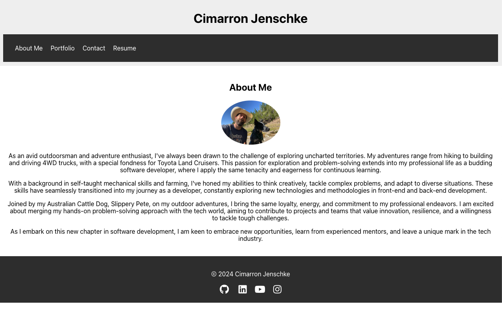

# Cimarron Jenschke's Portfolio

  

  ## Description
  Updated resume/portfolio, using React, showcases a few of my class projects.

  ## Table of Contents
  - [Usage](#usage)
  - [Credits](#credits)
  - [License](#license)
  - [Questions](#questions)

  
  

  ## Usage
  - Click <a href="https://gorgeous-truffle-536351.netlify.app/">LINK</a> to go to portfolio.

  ## Credits
  - ChatGPT
  - FontAwesome
  - EdX Coding Bootcamp at UT Austin
  
  ## License
  

  

  ## Questions
  If you have questions, you can contact me at [cimarron13@mac.com](mailto:cimarron13@mac.com) or <a href="https://github.com/cjenschke">GitHub</a>.